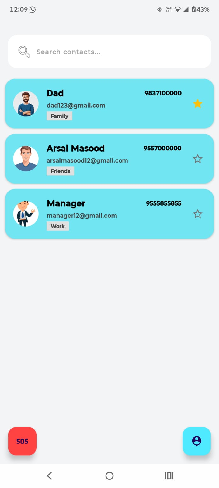
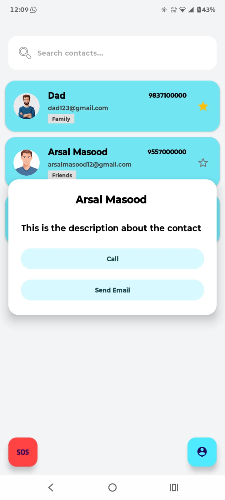
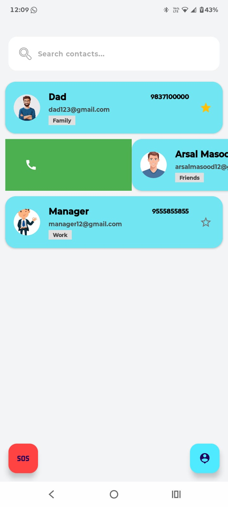
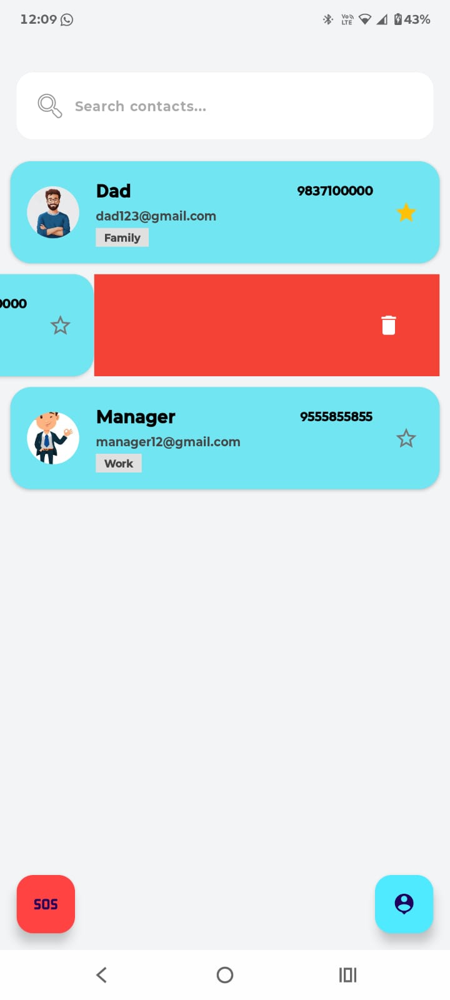
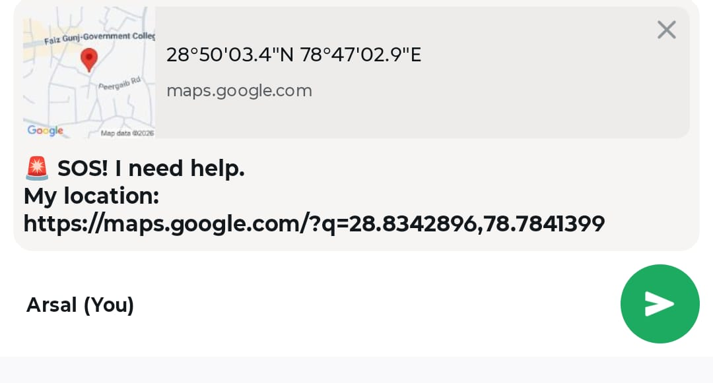
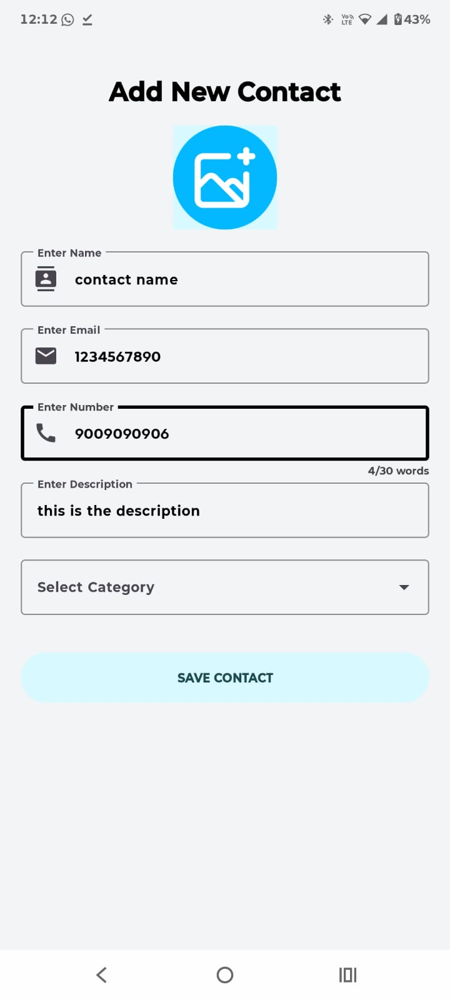
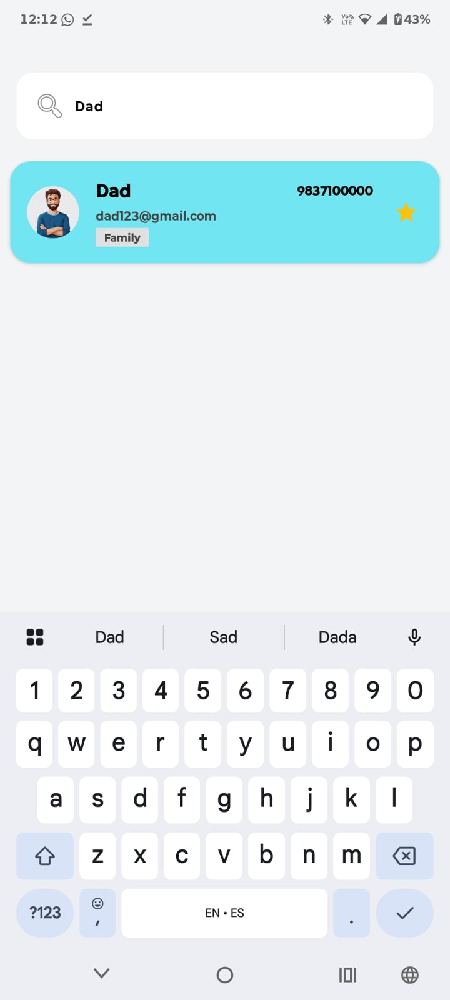

# Contact Manager

A modern and intuitive Android application designed to help users manage their contacts efficiently. With a sleek Material Design interface, the app provides seamless CRUD operations, advanced swipe actions, and a critical SOS feature for safety.

## Features

- **Efficient Contact Management**: Add, edit, and delete contacts with ease.
- **Advanced Swipe Actions**: 
  - Swipe **Right** to quickly initiate a call.
  - Swipe **Left** to delete a contact instantly.
- **Dynamic Search**: Find any contact in real-time as you type.
- **SOS Emergency Messaging**: Send your live location via WhatsApp in case of emergencies.
- **Favorites**: Mark important contacts as favorites for quick access.
- **Clean UI/UX**: Built with Material 3 design principles for a premium feel.

## Visual Tour

<table style="width: 100%; text-align: center;">
  <tr>
    <td style="width: 50%;">
      <b>Main Dashboard</b> 
       
      <i>The central hub for all your contacts.</i>
    </td>
    <td style="width: 50%;">
      <b>Contact Details</b> 
       
      <i>View details and initiate actions.</i>
    </td>
  </tr>
  <tr>
    <td>
      <b>Swipe to Call</b> 
       
      <i>Quick gesture for calling.</i>
    </td>
    <td>
      <b>Swipe to Delete</b> 
       
      <i>Quick gesture for deletion.</i>
    </td>
  </tr>
  <tr>
    <td>
      <b>SOS Feature</b> 
       
      <i>Emergency location sharing.</i>
    </td>
    <td>
      <b>Add Contact</b> 
       
      <i>Form to save new connections.</i>
    </td>
  </tr>
  <tr>
    <td>
      <b>Real-time Search</b> 
       
      <i>Instantly filter your list.</i>
    </td>
    <td></td>
  </tr>
</table>

## Tech Stack

- **Language**: Java
- **UI Framework**: Android XML with Material Design 3
- **Architecture**: MVVM (Model-View-ViewModel)
- **Database**: Room Persistence Library (Local SQLite)
- **Data Binding**: Used to bind UI components directly to data sources.
- **Architecture Components**:
  - `ViewModel`: Handles UI-related data in a lifecycle-conscious way.
  - `LiveData`: Notifies views of data changes automatically.
- **External Services**:
  - `Google Play Services Location`: For accurate SOS location tracking.
  - `WhatsApp Integration`: For sending emergency messages.

---
*Created with ❤️ for a better contact management experience.*
